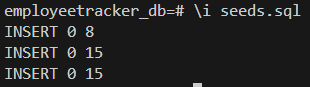

# employee-tracker
Command-line application to manage an employee database using Node.js, Inquirer, and PostgreSQL.

## Description

This application provides a non-developer with a method for interacting and viewing information stored in an employee database.  The database stores company data for departments, roles, and employee information.  

- I enjoyed becoming more familiar with the PostgreSQL code syntax and using the pg NPM package module. 
- I'm fairly content with how the application was refactored before deployment and the use of exported object modules.   
- Although the application lacks error handling, the Inquirer prompts are fairly robust in sanitzing user input. 
- For future development, this application could use more error handling and more database queries.  

## Table of Contents

- [Installation](#installation)
- [Usage](#usage)
- [Credits](#credits)
- [License](#license)
- [Questions](#questions)

## Installation

This application requires a runtime environment with Node.js and PostgreSQL installed.  With Node.js installed, clone the GitHub repository, then install dependencies in the project directory by running the following code in the terminal: npm install

Once you have a local version of the repository.  Open up the employee-tracker/utils/retrieve.js directory.  You must input your username and password for your PostgreSQL database. 

  

Lastly, in a terminal navigate to the employee-tracker/db/ directory in the local repository and sign into your PostgreSQL database executing this line of code psql -U postgre.  Proceed to authenticate with your password.

Then, initiate the schema.sql file for the database by executing: \i schema.sql

  

I recommend seeding the database with some example data by executing: \i seeds.sql

  

## Usage

Here is the [Code Repository](https://github.com/briandwach/employee-tracker) and a video demonstration of the application can be viewed [HERE](https://drive.google.com/file/d/1Qay4dC0hoFyHOtHfA1rzD6X35Ur-KLBh/view?usp=sharing).

This application is ran in a terminal with Node.js installed.  When in the root directory of the project, run the following code in the terminal: node index.js

The application will then present a series of selections.  Select how you would like to interact with the database and then follow the additonal prompts.

  

## Credits
This application utilizies the [inquirer-maxlength-input-prompt](https://www.npmjs.com/package/inquirer-maxlength-input-prompt) NPM package developed by [jwarby](https://github.com/jwarby).

## License
This application is covered under the [MIT License](http://choosealicense.com/licenses/mit/).

## Questions
Please email me with any questions regarding this application at: brian.d.wach@gmail.com

Additionally, checkout more of my work on GitHub: [briandwach](https://github.com/briandwach)